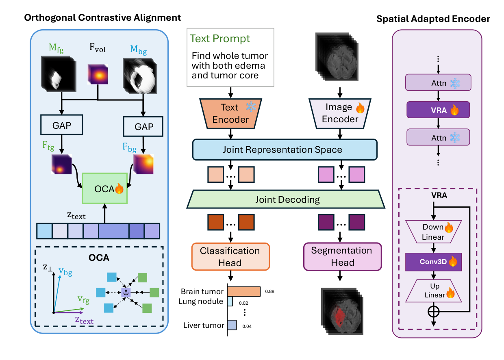
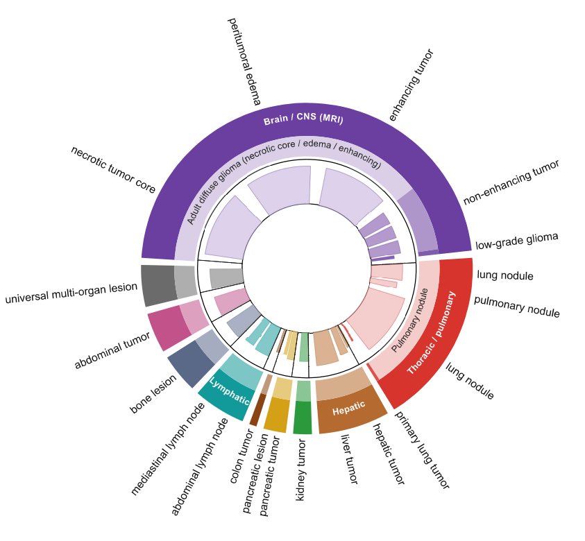
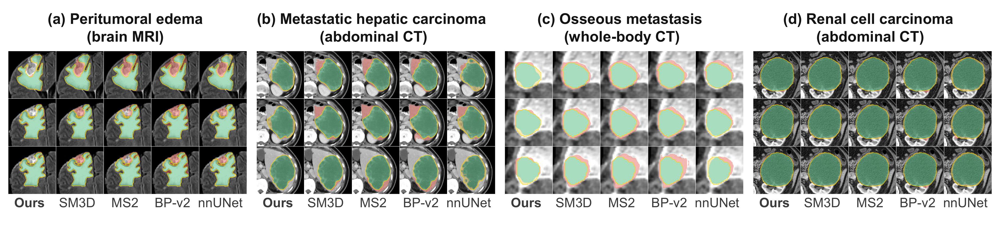

# OmniTumor

A **spatial vision-language model** for text-prompted volumetric tumor and lesion segmentation across CT and MRI.

OmniTumor adapts a frozen 2D backbone into a 3D-aware, text-prompted segmenter through two lightweight
modules, and is evaluated on the [OmniTumorData](https://huggingface.co/datasets/fadefade/OmniTumorData/)
benchmark: 17 public cohorts, 10,241 annotated cases, brain MRI plus abdominal, hepatic and thoracic CT.

> **The paper is the authoritative description of the method.** Where this repository and the manuscript
> disagree on naming or numbers, the manuscript is correct and this repository will be updated to match.



*Schematic of the OmniTumor framework. **(Right) SAE:** Volumetric Residual Adapters (VRA) are inserted after every frozen 2D Transformer block (snowflakes) to aggregate volumetric context with a depth-axis convolution while preserving the pretrained 2D priors. **(Left) OCTA:** a training-only objective (dashed) that decouples features into foreground and background prototypes via the ground-truth mask, aligning the foreground prototype with the text embedding and orthogonalizing the background prototype to it. **(Middle) Joint Decoding:** spatially enhanced features and text embeddings are fused to predict the final 3D mask.*

## Method

- **SAE — Spatially Adapted Encoder.** A slice-to-batch reshape feeds a 3D volume through a frozen 2D Transformer; **VRA (Volumetric Residual Adapter)** modules with a `3x1x1` depth-axis convolution are inserted after every frozen block to re-inject inter-slice context without the quadratic cost of full 3D self-attention.
- **OCTA — Orthogonal Contrastive Text-Visual Alignment.** A training-only loss that aligns the pooled foreground prototype with the text embedding while driving the cosine similarity between the pooled background prototype and the text embedding toward zero, rather than toward -1.
- **Sub-region prompt ontology with synonymous augmentation.** Sub-region distinctions (necrotic core, edema and enhancing tumor in BraTS; abdominal versus mediastinal lymph nodes; and so on) are preserved end to end, and each of the 20 canonical prompts is expanded into 20 variants, yielding 400 unique strings.
- **Tau-scheduled mixed-cohort sampler.** Cohort `m` is drawn with probability proportional to `|D_m|^tau`, with `tau = 1/2` during warmup and cooldown and `tau = 1` during the main phase, so that small cohorts are not drowned out by larger ones.

## OmniTumorData benchmark



*Radial chart of the segmentation targets in OmniTumorData. The outer ring groups targets by anatomical region; brain is the only MRI region and the remainder are CT. The radial bar drawn inward for each target encodes the relative size of its (cohort, target) annotation stream. In aggregate the benchmark comprises 10,241 annotated cases and approximately 2.55 million axial slices across two modalities.*

## Qualitative comparison



*Qualitative comparison on four held-out cases, three consecutive axial slices per case. Green: true positive; red: false positive; amber: false negative; yellow outline: ground truth. SM3D and MS2 receive an oracle bounding box, OmniTumor and BP-v2 a text prompt; nnUNet is a supervised per-cohort model.*

## Repository layout

```
omnitumor/
├── modeling/
│   ├── adapters.py      # VolumetricResidualAdapter (dense + token variants)
│   ├── encoder.py       # SpatiallyAdaptedEncoder (SAE)
│   └── backbone.py      # VRAWrappedBackbone (FocalNet integration)
├── losses/
│   └── octa.py          # OCTALoss (Orthogonal Contrastive Text-Visual Alignment)
├── data/
│   ├── dataset.py       # OmniTumorDataset + SEEM-compatible collator
│   └── sampler.py       # tau-scheduled mixed-cohort sampler
└── engine/
    ├── builder.py       # build_omnitumor_model
    └── trainer.py       # end-to-end training loop

prompts/                 # label-to-prompt mapping, prompt variants, conversion rules
checkpoints/             # pointer to the released weights
scripts/
└── train.py             # CLI entry point
```

## Text prompts

The complete mapping from original dataset labels to canonical prompts, the 400 prompt variants, and the
conversion rules live in [`prompts/`](prompts/). These files will be released after publication.

## Pretrained weights

The pretrained OmniTumor checkpoint is hosted on the Hugging Face Hub under gated access:

<https://huggingface.co/datasets/fadefade/OmniTumorData/>

See [`checkpoints/README.md`](checkpoints/README.md) for details. The checkpoint is 1.8 GB and is therefore
not mirrored in this repository.

Use the package programmatically:

```python
from omnitumor.modeling import SpatiallyAdaptedEncoder, VRAWrappedBackbone
from omnitumor.losses import OCTALoss
from omnitumor.data import OmniTumorDataset, TauScheduledMultiDatasetSampler
```

## Training

`scripts/train.py` is the CLI entry point that produced the released checkpoint. It wires VRA adapters into
the frozen FocalNet backbone and adds OCTA on top of the SEEM decoder pipeline. The trainer reuses the
BiomedParse implementation of the SEEM model, pixel decoder and criterion as-is, so it must be run from
inside a BiomedParse checkout:

```bash
# 1. Clone BiomedParse and install its dependencies
git clone https://github.com/microsoft/BiomedParse.git
cd BiomedParse
pip install -r ../OmniTumor/requirements.txt

# 2. Drop the OmniTumor package + entry script into the BiomedParse root
cp -r ../OmniTumor/omnitumor .
cp ../OmniTumor/scripts/train.py .

# 3. Place OmniTumorData and the pretrained backbone checkpoint
#    OmniTumorData/dataset_metadata_v2.json
#    pretrained/biomedparse_v1.pt

# 4. Train
python train.py --data_dir OmniTumorData \
                --pretrained pretrained/biomedparse_v1.pt \
                --output_dir output/omnitumor
```

## License

- **Code:** Apache-2.0 (see `LICENSE`)
- **Pretrained weights:** CC BY-NC 4.0, non-commercial research use only, released under gated access on
  the Hugging Face Hub. The weights are trained on cohorts whose original licenses are non-commercial
  and non-redistributable, so they cannot be released under a permissive licence.
- **Dataset:** each constituent cohort retains its original license; see
  [OmniTumorData on Hugging Face](https://huggingface.co/datasets/fadefade/OmniTumorData/)

## Contact

Songlin Zhao, Zhao.Songlin@mayo.edu

## Acknowledgements

OmniTumor builds heavily on [BiomedParse](https://github.com/microsoft/BiomedParse) (Zhao et al.,
*Nature Methods* 2025), which in turn builds on [SEEM](https://github.com/UX-Decoder/Segment-Everything-Everywhere-All-At-Once).
We thank the maintainers of the 17 source cohorts that comprise OmniTumorData; per-source citation is
documented in the dataset README.
